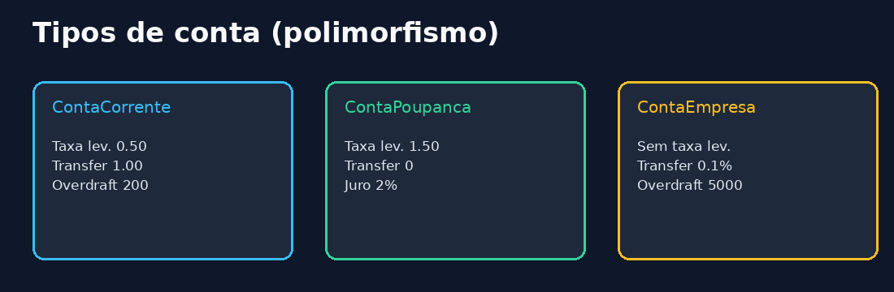
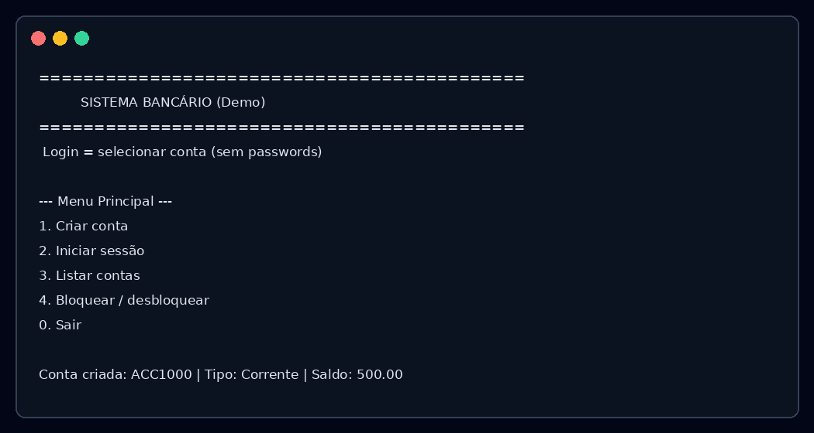

# Sistema Bancário

Aplicação de terminal em **C++17** que simula operações bancárias. Projeto intermediário com arquitetura em camadas, pensado para demonstrar engenharia de software — **não** é um sistema bancário real.

> Todo o código-fonte (identificadores, comentários e mensagens) está em **português**, com excepção das palavras reservadas da linguagem C++.

> **Aviso de segurança:** não há autenticação real. O “iniciar sessão” apenas seleciona uma conta e abre uma sessão de demonstração em memória. **Nenhuma palavra-passe ou credencial é armazenada.** Não use este código em produção nem com dados reais.

## Capturas

### Arquitetura


### Tipos de conta



### Consola (demo)



## Funcionalidades

| Funcionalidade | Descrição |
|---|---|
| Criação de contas | Corrente, Poupança e Empresa |
| Iniciar sessão (demo) | Seleção de conta por ID — sem credenciais |
| Depósito / Levantamento | Com taxas polimórficas por tipo de conta |
| Transferência | Entre contas, com taxa no remetente |
| Consulta de saldo | Saldo, descoberto e taxa de juro |
| Histórico | Lista de transações da conta |
| Bloqueio de conta | Bloquear / desbloquear |
| Alteração de dados | Nome, email e telefone |
| Extrato | Ficheiro de texto gerado em `data/` |
| Persistência | CSV via file streams (`contas.csv`, `transacoes.csv`) |

## Arquitetura em camadas

```
┌─────────────────────────────────────┐
│  UI          InterfaceConsola       │
├─────────────────────────────────────┤
│  Negócio     ServicoBancario, Sessao│
├─────────────────────────────────────┤
│  Domínio     Conta*, Transacao      │
├─────────────────────────────────────┤
│  Dados       Repositórios + CSV     │
└─────────────────────────────────────┘
```

Detalhes em [docs/ARCHITECTURE.md](docs/ARCHITECTURE.md).

## Requisitos C++ demonstrados

- `class` / herança / polimorfismo (`Conta` → Corrente / Poupança / Empresa)
- `std::vector`, `std::unordered_map`
- Smart pointers (`unique_ptr`, `shared_ptr`)
- Exceções tipadas (`ExcecaoBancaria` e derivadas)
- File streams (`fstream`) para persistência e logging
- `enum class` (`TipoConta`, `TipoTransacao`, …)
- Templates (`IRepositorio<T>`, justificado como contrato CRUD reutilizável)

## Build

Requisitos: **CMake ≥ 3.16**, **g++/clang++ com C++17**.

```bash
export PATH="$HOME/.local/cmake/bin:$PATH"
cmake -S . -B build -DCMAKE_BUILD_TYPE=Release
cmake --build build
ctest --test-dir build --output-on-failure
```

Binário: `build/sistema_bancario`

## Execução

```bash
./build/sistema_bancario          # usa ./data
./build/sistema_bancario /tmp/bs  # diretório de dados personalizado
```

Fluxo típico:

1. Criar conta (guardar o ID, ex. `ACC1000`)
2. Iniciar sessão com o ID
3. Depositar, levantar, transferir, consultar histórico
4. Gerar extrato → `data/extrato_ACC1000.txt`

## Testes

Suite em `tests/test_main.cpp` (asserts leves, sem framework externo):

- análise de valores monetários
- CSV escapar/dividir
- taxas polimórficas
- validação
- round-trip de persistência
- fluxo completo do serviço (depósito, levantamento, transferência, bloqueio, extrato, sessão)

```bash
./build/testes_banca
```

## Estrutura do projeto

```
BankingSystem/
├── CMakeLists.txt
├── README.md
├── LICENSE
├── include/banca/
│   ├── comum/      Tipos, Excecoes, Registador, Validacao
│   ├── dominio/    Hierarquia Conta, Transacao, FabricaContas
│   ├── dados/      Repositorios, UtilCsv
│   ├── negocio/    ServicoBancario, Sessao, GeradorIds
│   └── ui/         InterfaceConsola
├── src/main.cpp
├── tests/
├── docs/
└── data/           Criado em runtime (CSV + logs + extratos)
```

## Logging

Logs em stderr e, se possível, em `data/banca.log`.

## Licença

MIT — ver [LICENSE](LICENSE).
