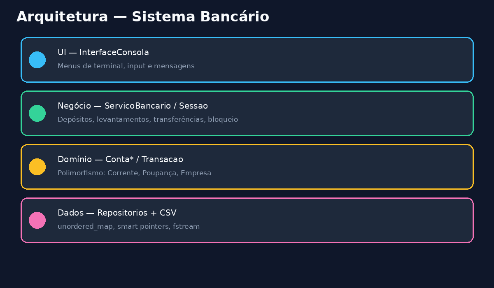

# Arquitetura



## Camadas

### UI (`banca/ui`)

- `InterfaceConsola`: menus de terminal, leitura de input, apresentação de resultados.
- Não contém regras de negócio; delega tudo a `ServicoBancario`.
- Traduz exceções de domínio em mensagens amigáveis.

### Negócio (`banca/negocio`)

- `ServicoBancario`: orquestra criação de contas, movimentos, bloqueio, extratos e sessão.
- `Sessao` / `GestorSessao`: sessão **em memória**. Abrir sessão = selecionar conta por ID. Sem verificação de password.
- `GeradorIds`: IDs de conta (`ACC…`), transação (`TX…`) e token de sessão demo.

### Domínio (`banca/dominio`)

- `Conta` (abstrata): saldo, estado, dados do titular; interface polimórfica para taxas, juro e descoberto.
- `ContaCorrente`, `ContaPoupanca`, `ContaEmpresa`: regras distintas.
- `FabricaContas`: cria a subclasse correta a partir de `TipoConta`.
- `Transacao`: registo imutável de movimento.

### Dados (`banca/dados`)

- `IRepositorio<T>`: contrato template de repositório.
- `RepositorioContas`: `unordered_map` em memória + persistência CSV.
- `RepositorioTransacoes`: índice por conta + lista global; CSV.
- `UtilCsv`: escapar/dividir CSV.

### Comum (`banca/comum`)

- `enum class` para tipos e estados.
- Exceções tipadas (`ExcecaoValidacao`, `ExcecaoFundosInsuficientes`, …).
- `Registador` (singleton thread-safe).
- Validação de nome, email, telefone e montantes (centavos inteiros).

## Dinheiro

Valores monetários usam `Centavos` (`int64_t`) para evitar erros de vírgula flutuante. A UI aceita strings como `100.50`.

## Formato de persistência

`contas.csv`:

```
id,tipo,nomeTitular,email,telefone,saldoCentavos,estado
```

`transacoes.csv`:

```
id,idConta,tipo,montanteCentavos,saldoAposCentavos,descricao,idContaRelacionada,carimboTempo
```

## Tratamento de erros

Operações de negócio validam entrada e estado da conta. Falhas lançam exceções derivadas de `ExcecaoBancaria`, capturadas na UI e registadas no registador.

## Política de sessão demo

Este projeto **não** implementa autenticação. Em produção, a identidade seria validada por um serviço externo (OAuth, IdP, etc.). Aqui, iniciar sessão existe apenas para estruturar o menu pós-seleção de conta.
